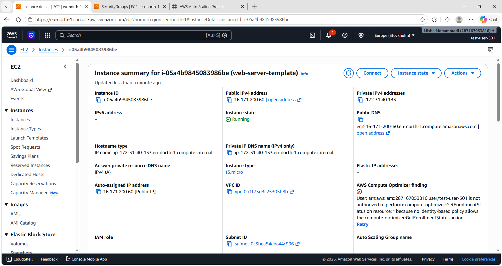
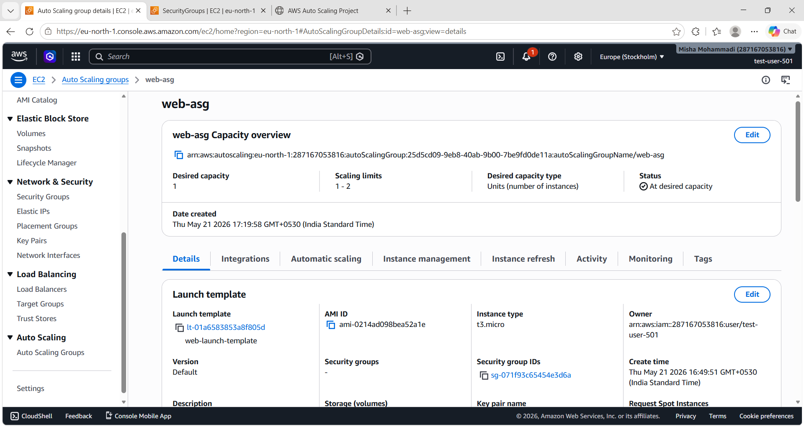
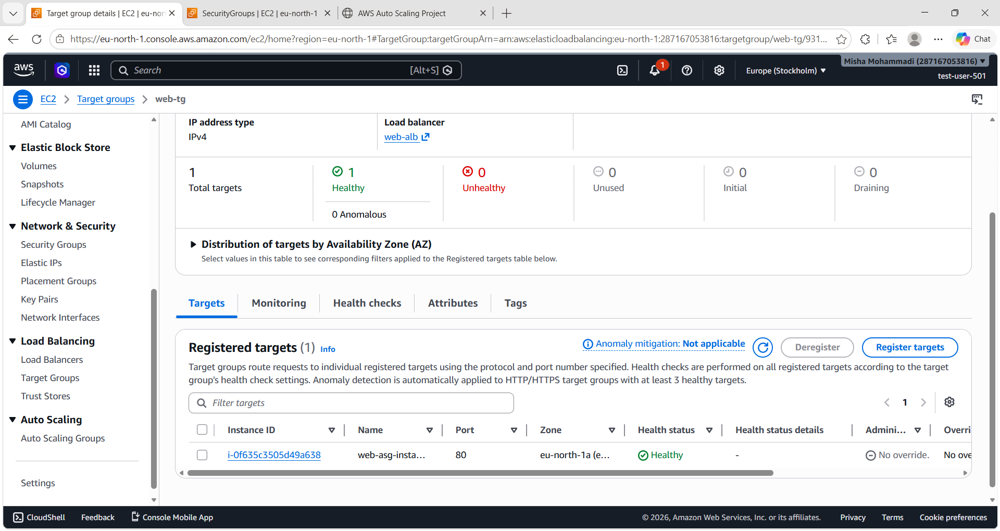
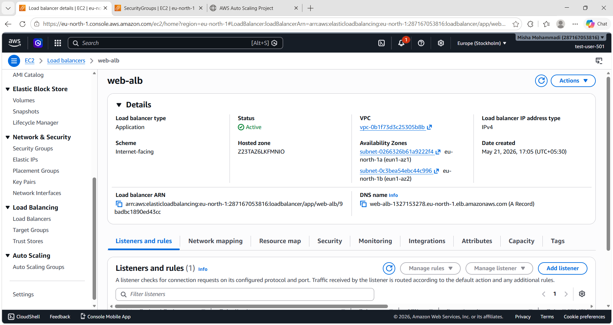
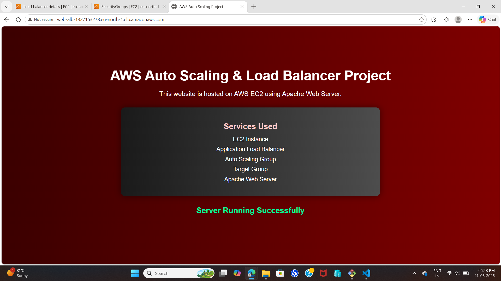
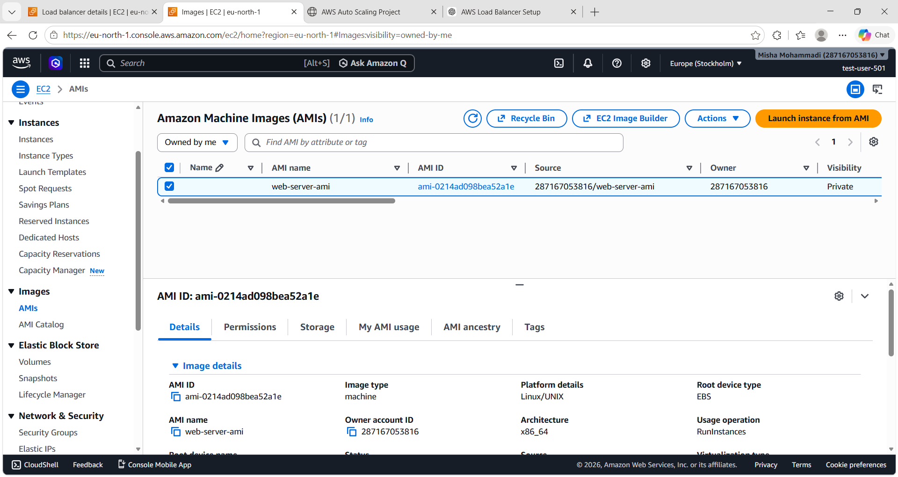

# AWS Scalable Web Architecture Project

## 🚀 Project Overview
This project demonstrates a highly available and scalable web application deployed on AWS using EC2, Application Load Balancer, and Auto Scaling Group.

---

## 🏗️ Architecture
- EC2 (Web Server)
- Application Load Balancer (ALB)
- Target Group
- Auto Scaling Group (ASG)
- Amazon Machine Image (AMI)

---

## ⚙️ AWS Services Used
- Amazon EC2
- Elastic Load Balancing (ALB)
- Auto Scaling Group
- Amazon Machine Image (AMI)
- Security Groups
- VPC (default)

---

## 📸 Screenshots

### 1. EC2 Instance Running

### 2. Auto Scaling Group

### 3. Target Group

### 4. Load Balancer

### 5. Website Output

### 6. AMI Created

---

## 🌐 Final Output
The application is accessible via the Application Load Balancer DNS name and automatically scales based on demand.

---

## 📈 Key Learning
- Cloud infrastructure design
- High availability architecture
- Load balancing
- Auto scaling in AWS
- Image-based deployment using AMI

---

## 🧑‍💻 Author
Misha Mohammadi  
Information Science Engineering Graduate  
AWS & Cloud Computing Enthusiast
